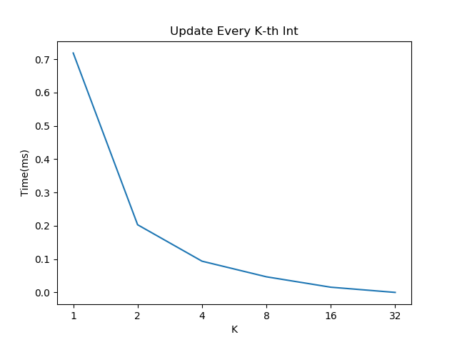

[](https://pubsonline.informs.org/journal/ijoc)

# Deterring the Gray Market: Product Diversion Detection via Learning Disentangled Representations of Multivariate Time Series

This archive is distributed in association with the [INFORMS Journal on
Computing](https://pubsonline.informs.org/journal/ijoc) under the [MIT License](LICENSE).

The software and data in this repository are a snapshot of the software and data
that were used in the research reported on in the paper 
[Deterring the Gray Market: Product Diversion Detection via Learning Disentangled Representations of Multivariate Time Series](https://doi.org/10.1287/ijoc.2022.0155) by Hao Lin, Guannan Liu, Junjie Wu, and J. Leon Zhao.

## Cite

To cite the contents of this repository, please cite both the paper and this repo, using their respective DOIs.

https://doi.org/10.1287/ijoc.2022.0155

https://doi.org/10.1287/ijoc.2022.0155.cd

Below is the BibTex for citing this snapshot of the respoitory.

```
@article{lin2023deterring,
  author =        {Lin, Hao and Liu, Guannan and Wu, Junjie and Zhao, J Leon},
  publisher =     {INFORMS Journal on Computing},
  title =         {Deterring the Gray Market: Product Diversion Detection via Learning Disentangled Representations of Multivariate Time Series},
  year =          {2023},
  doi =           {10.1287/ijoc.2022.0155.cd},
  url =           {https://github.com/INFORMSJoC/2022.0155},
}  
```

## Contact Details

If you have questions about the paper or the code, please contact Dr. Hao Lin [haolin@buaa.edu.cn](mailto:haolin@buaa.edu.cn).

## Description

The goal of this software is to facilitate readers to reproduce the experimental results in this paper. The experiments verify the effectiveness of the proposed model on both real-world and synthetic data sets.

## Environment Requirements

To run the code, you will need to make sure that you have the following dependencies installed:

* `Python` 3.6 with `pytorch` 1.4.0, `numpy`, `scikit-learn`

## Results

Figure 1 in the paper shows the results of the multiplication test with different
values of K using `gcc` 7.5 on an Ubuntu Linux box.


Figure 2 in the paper shows the results of the sum test with different
values of K using `gcc` 7.5 on an Ubuntu Linux box.



## Replicating

To replicate the results in [Figure 1](results/mult-test), do either

```
make mult-test
```
or
```
python test.py mult
```
To replicate the results in [Figure 2](results/sum-test), do either

```
make sum-test
```
or
```
python test.py sum
```

## Acknowledgement

We would like to thank the editors and anonymous reviewers for their detailed and constructive feedbacks in helping improve the paper.

## Ongoing Development

This code is being developed on an on-going basis at the author's
[Github site](https://github.com/linhaobuaa/IJOC.2022.0155).

## Support

For support in using this software, please submit an
[issue](https://github.com/linhaobuaa/IJOC.2022.0155/issues/new).
